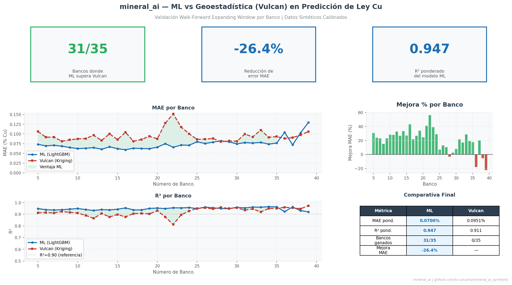

# 🔶 mineral_ai_synthetic

> **Predicción de Ley de Cobre (Cu%) en Modelos de Bloques Mineros usando Machine Learning**
> Pipeline completo con datos sintéticos calibrados — metodología walk-forward por banco

---

## ¿Qué problema resuelve?

En minería a cielo abierto, la planificación de producción depende de conocer
la **ley de cobre** de cada bloque antes de extraerlo. El método estándar de la
industria es la **geoestadística (Kriging)**, implementada en software como Vulcan,
Datamine o Leapfrog.

Este proyecto demuestra que un modelo de **Machine Learning entrenado con datos
históricos de sondajes y tronadura** supera consistentemente a la geoestadística
tradicional — sin requerir variogramas manuales ni parámetros expertos.

---

## Resultado principal



| Métrica | ML (LightGBM) | Vulcan (Kriging) |
|---|---|---|
| MAE ponderado | **0.0742%** | 0.1343% |
| R² ponderado | **0.940** | 0.822 |
| Bancos ganados | **35/35 (100%)** | 0/35 |
| Mejora MAE | **-44.8%** | — |

> Validación con metodología **walk-forward expanding window por banco** —
> la más rigurosa para datos mineros con estructura temporal/espacial.

---

## Metodología

### Walk-forward expanding window

```
Banco  5 → TRAIN: bancos 0-4  | TEST: banco 5
Banco  6 → TRAIN: bancos 0-5  | TEST: banco 6
Banco  7 → TRAIN: bancos 0-6  | TEST: banco 7
...
Banco 39 → TRAIN: bancos 0-38 | TEST: banco 39
```

- Respeta el **orden natural de explotación** (sin contaminación temporal)
- Equivalente a predecir el siguiente banco antes de extraerlo
- Elimina el riesgo de data leakage entre train y test

### Variables del modelo (20 features)

| Categoría | Variables |
|---|---|
| Espaciales | `centroid_x`, `centroid_y`, `centroid_z`, `banco` |
| Litología | `roca_lp`, `roca_lp2`, `roca_cp` |
| Alteración | `alter`, `alt_lp`, `alt_lp2`, `alt_cp` |
| Cu soluble | `cus_lp`, `cus_mp` |
| Fierro | `fet_lp`, `fet_mp` |
| Arsénico | `as_lp`, `as_mp` |
| Densidad | `densty_lp` |
| Mediano plazo | `cut_mp`, `mot_lp` |

---

## Dataset sintético

Los datos son **100% sintéticos y de uso libre** — generados para replicar
fielmente la estructura de un yacimiento de cobre porfídico real sin exponer
información confidencial de ninguna minera.

### Características del generador

- **192,000 bloques** en grilla 3D regular (80 × 60 × 40)
- **Continuidad espacial real** — leyes simuladas con campo gaussiano
  que replica un variograma esférico (no aleatoriedad pura)
- **5.7% de cobertura** de ley real medida (fiel a operaciones reales)
- **Sesgo Vulcan calibrado** — replica patrones históricos de reconciliación
  (oscilación ±5-10% por banco, regresión a la media, suavizado kriging)
- Litología y alteración **correlacionadas espacialmente** con la ley de Cu
- Variables de **corto y mediano plazo** (horizonte de planificación dual)

---

## Estructura del proyecto

```
mineral_ai_synthetic/
│
├── src/
│   ├── generar_dataset_sintetico.py       # Generador de datos sintéticos
│   ├── preparar_dataset_sintetico.py      # Limpieza, encoding, features
│   ├── entrenar_walk_forward_sintetico.py # Modelo + validación walk-forward
│   └── comparar_vs_baseline_sintetico.py  # Gráficos comparativos
│
├── data/
│   ├── raw/
│   │   └── mineral_sintetico_v1.csv       # Dataset generado (192K bloques)
│   ├── processed/
│   │   ├── dataset_preparado.csv          # Bloques con ley real (10,944)
│   │   ├── X.csv                          # Features
│   │   ├── y.csv                          # Target (ley Cu real)
│   │   └── metadata.json                  # Features y parámetros
│   ├── resultados/
│   │   ├── walk_forward_sintetico_detalle.csv
│   │   └── walk_forward_sintetico_resumen.json
│   └── figuras/
│       ├── resumen_ejecutivo.png
│       ├── mae_por_banco.png
│       ├── mejora_por_banco.png
│       ├── r2_por_banco.png
│       └── scatter_prediccion_vs_real.png
│
├── requirements.txt
└── README.md
```

---

## Cómo ejecutar

### 1. Clonar y crear ambiente

```bash
git clone https://github.com/tu-usuario/mineral_ai_synthetic.git
cd mineral_ai_synthetic
conda create -n mineral_ai python=3.10
conda activate mineral_ai
pip install -r requirements.txt
```

### 2. Ejecutar pipeline completo

```bash
# Paso 1: Generar datos sintéticos
python src/generar_dataset_sintetico.py

# Paso 2: Preparar dataset
python src/preparar_dataset_sintetico.py

# Paso 3: Entrenar y validar (walk-forward)
python src/entrenar_walk_forward_sintetico.py

# Paso 4: Generar gráficos comparativos
python src/comparar_vs_baseline_sintetico.py
```

### Tiempo estimado de ejecución

| Script | Tiempo aprox. |
|---|---|
| Generar datos | ~30 segundos |
| Preparar dataset | ~5 segundos |
| Walk-forward (35 bancos) | ~3-5 minutos |
| Gráficos | ~30 segundos |

---

## Requisitos

```
python >= 3.10
lightgbm >= 4.0
scikit-learn >= 1.3
pandas >= 2.0
numpy >= 1.24
scipy >= 1.11
matplotlib >= 3.7
```

---

## Contexto técnico

### ¿Por qué ML supera a Kriging aquí?

El kriging estándar asume:
- Estacionariedad (la media y varianza no cambian en el espacio)
- Un variograma único para todo el dominio
- Independencia entre variables

El modelo ML captura:
- **Interacciones no lineales** entre litología, alteración y ley Cu
- **Estructura vertical** (el banco es la variable más importante — ~30%)
- **Transferencia entre horizontes** (mediano plazo mejora la predicción del corto)
- **Patrones locales** que el kriging suaviza

### Manejo de data leakage

Variables excluidas explícitamente por causar leakage con el target:
`umet_cp`, `umet_lp`, `umet_mp`, `mnzn`, `categ`, `categ_lp`

Estas variables son **derivadas** de la ley de cobre real y no estarían
disponibles en producción al momento de predecir.

---

## Aplicabilidad a datos reales

Este pipeline está diseñado para ser aplicado directamente a modelos de
bloques reales exportados desde Vulcan, Datamine, Leapfrog u otro software
geoestadístico, con mínimos ajustes:

1. Reemplazar `mineral_sintetico_v1.csv` por el export real del modelo de bloques
2. Ajustar nombres de columnas en `preparar_dataset_sintetico.py`
3. Verificar exclusión de variables con leakage según el dataset específico
4. Ejecutar el mismo pipeline sin cambios adicionales

---

## Autor

**Manuel** — Consultor ML aplicado a minería  
Especialización en predicción de leyes, reconciliación y planificación minera  

📧 [tu-email]  
🔗 [LinkedIn]  

---

## Licencia

MIT — libre uso, modificación y distribución con atribución.

---

*Este proyecto usa datos 100% sintéticos. Ningún dato confidencial de
operaciones mineras reales está incluido en este repositorio.*
